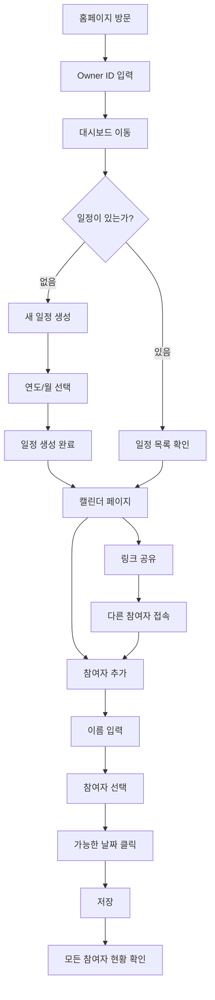
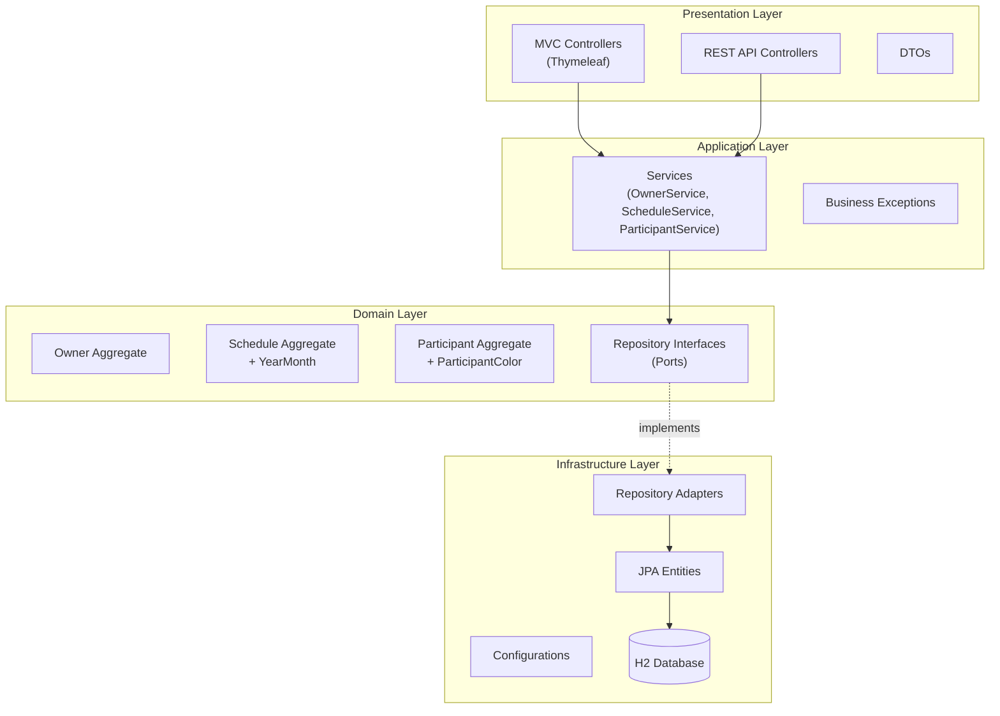
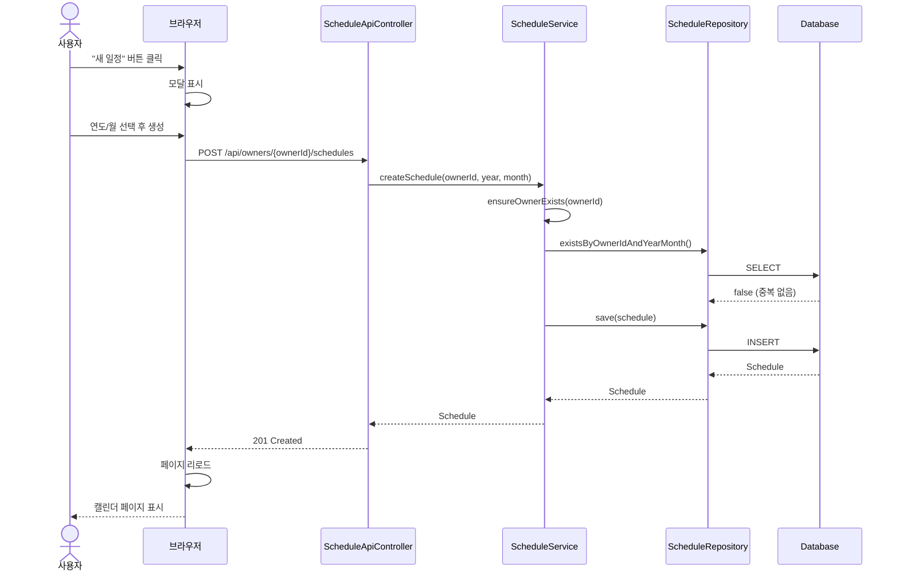
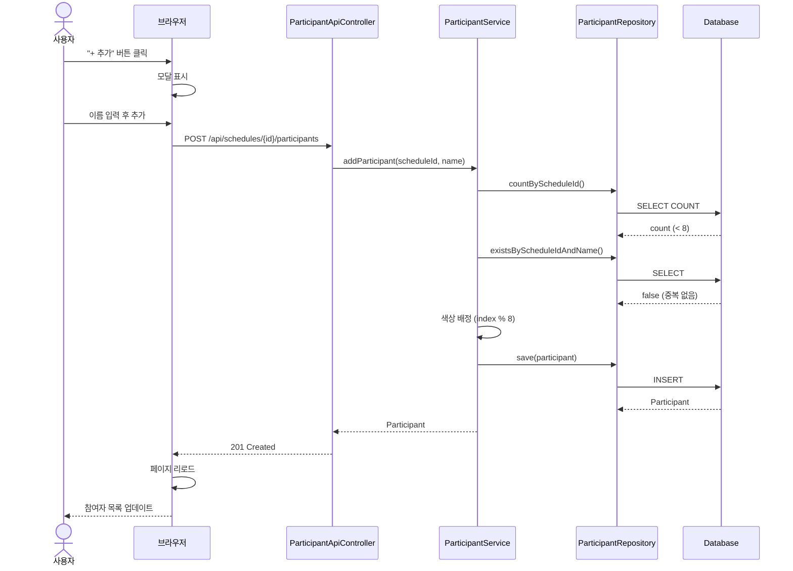
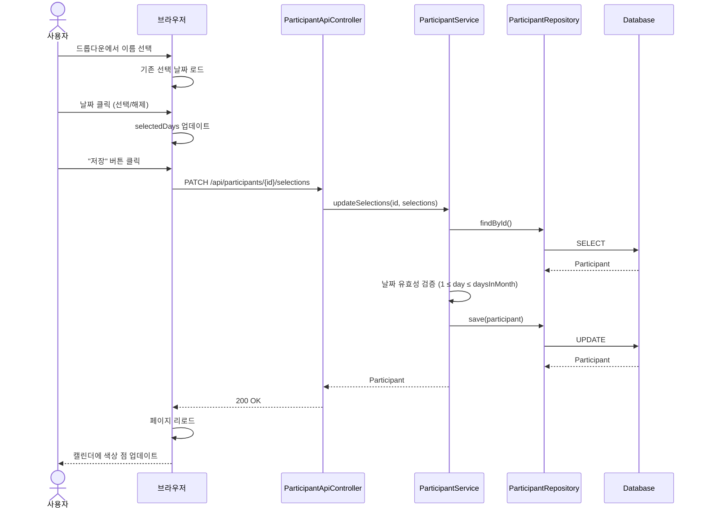

# DateDate (약속 잡기)

그룹 일정 조율을 위한 웹 어플리케이션 - 여러 명이 함께 가능한 날짜를 쉽게 찾아보세요.

---

## 목차

1. [서비스 소개](#서비스-소개)
2. [유저 플로우](#유저-플로우)
3. [시스템 아키텍처](#시스템-아키텍처)
4. [시퀀스 다이어그램](#시퀀스-다이어그램)
5. [Tech Stack](#tech-stack)
6. [실행방법](#실행방법)
7. [API Reference](#api-reference)
8. [프로젝트 구조](#프로젝트-구조)
9. [License](#license)

---

## 서비스 소개

### 해결하는 문제

그룹 모임이나 팀 미팅 일정을 잡을 때, 여러 사람의 가능한 날짜를 조율하는 것은 번거로운 일입니다.
카톡방에서 "언제 되세요?" 질문에 각자 다른 형식으로 답변하고, 그걸 취합하는 것도 일이죠.

**DateDate**는 이 문제를 해결합니다:
- 캘린더 형태로 각자 가능한 날짜를 클릭
- 모든 참여자의 선택이 한눈에 보임
- 링크 하나로 간편하게 공유

### 주요 기능

| 기능 | 설명 |
|------|------|
| 나만의 페이지 | 고유 ID로 개인 일정 관리 페이지 생성 (예: `datedate.site/my-team`) |
| 월별 일정 생성 | 원하는 연도/월의 일정 생성 및 관리 |
| 참여자 추가 | 일정당 최대 8명의 참여자 등록 |
| 날짜 선택 | 각 참여자가 가능한 날짜를 클릭하여 선택 |
| 시각적 확인 | 캘린더에서 모든 참여자의 가능 날짜를 색상 점으로 확인 |
| 링크 공유 | URL 복사 버튼으로 참여자 초대 |

### 대상 사용자

- 팀 미팅 일정을 조율해야 하는 팀 리더
- 모임 날짜를 정해야 하는 친구 그룹
- 회의 일정을 조율하는 직장인
- 스터디 그룹 일정을 정하는 학생

---

## 유저 플로우

### 전체 흐름 다이어그램



### Owner (일정 생성자) 여정

| 단계 | 화면 | 행동 | 결과 |
|------|------|------|------|
| 1 | 홈(`/`) | 고유 ID 입력 (예: `our-team`) | Owner 페이지 생성 |
| 2 | 대시보드(`/{ownerId}`) | "새 일정" 버튼 클릭 | 모달 열림 |
| 3 | 모달 | 연도/월 선택 후 생성 | 캘린더 페이지로 이동 |
| 4 | 캘린더 | "링크 복사" 버튼 클릭 | 클립보드에 URL 복사 |
| 5 | - | 참여자들에게 링크 공유 | 참여자 접근 가능 |

### Participant (참여자) 여정

| 단계 | 화면 | 행동 | 결과 |
|------|------|------|------|
| 1 | 캘린더 | 공유받은 링크로 접속 | 캘린더 페이지 표시 |
| 2 | 캘린더 | "+ 추가" 버튼 클릭 | 이름 입력 모달 열림 |
| 3 | 모달 | 이름 입력 후 추가 | 참여자 목록에 추가, 고유 색상 배정 |
| 4 | 캘린더 | 드롭다운에서 본인 이름 선택 | 선택 모드 활성화 |
| 5 | 캘린더 | 가능한 날짜 클릭 | 날짜 선택/해제 토글 |
| 6 | 캘린더 | "저장" 버튼 클릭 | 선택 완료, 캘린더에 색상 점 표시 |

### 결과 확인

모든 참여자의 선택이 캘린더에 **색상 점(dot)**으로 표시됩니다:
- 각 참여자는 고유한 색상 보유 (8가지 프리셋)
- 특정 날짜에 점이 많을수록 많은 사람이 가능한 날짜

---

## 시스템 아키텍처

### 헥사고날 아키텍처 (Ports & Adapters)



### 계층별 역할

| 계층 | 패키지 | 역할 | 주요 구성요소 |
|------|--------|------|--------------|
| **Presentation** | `presentation/` | HTTP 요청/응답 처리 | Controllers, DTOs, Templates |
| **Application** | `application/` | 비즈니스 로직 조율 | OwnerService, ScheduleService, ParticipantService |
| **Domain** | `domain/` | 핵심 비즈니스 규칙 | Owner, Schedule, Participant (Aggregates) |
| **Infrastructure** | `infrastructure/` | 외부 시스템 연동 | JPA Entities, Repository Adapters |

### 핵심 설계 패턴

- **Ports & Adapters**: Domain 계층이 Repository 인터페이스(Port)를 정의, Infrastructure 계층이 구현(Adapter)
- **Aggregate Pattern**: Owner, Schedule, Participant가 각각 독립적인 집합체
- **Value Objects**: `YearMonth`, `ParticipantColor`를 Java Record로 구현
- **Immutability**: 컬렉션 반환 시 unmodifiable wrapper 사용

---

## 시퀀스 다이어그램

### 1. 일정 생성 (Create Schedule)



### 2. 참여자 추가 (Add Participant)



### 3. 날짜 선택 저장 (Update Selections)



---

## Tech Stack

### Backend

| 분류 | 기술 | 버전 | 비고 |
|------|------|------|------|
| Language | Java | 21 (LTS) | |
| Framework | Spring Boot | 4.0.0 | |
| ORM | Spring Data JPA | - | |
| Persistence | Hibernate | - | |
| Validation | Jakarta Bean Validation | - | |
| Utility | Lombok | - | |

### Database

| 분류 | 기술 | 비고 |
|------|------|------|
| RDBMS | H2 Database | MySQL 호환 모드 |
| Mode | File-based | `./data/scheduledb` |

### Frontend

| 분류 | 기술 | 비고 |
|------|------|------|
| Template Engine | Thymeleaf | Server-side rendering |
| JavaScript | Vanilla JS (ES6+) | 프레임워크 없음 |
| Styling | CSS3 | Custom properties, Flexbox, Grid |

### Build & Test

| 분류 | 기술 |
|------|------|
| Build Tool | Gradle |
| Testing | JUnit 5 |
| Mocking | Mockito |
| Assertions | AssertJ |

---

## 실행방법

### 사전 요구사항

- **Java 21** (LTS)
- **Gradle** (또는 프로젝트 내장 Gradle Wrapper 사용)

### 환경 설정

1. 프로젝트 클론
```bash
git clone https://github.com/your-repo/calendar.git
cd calendar
```

2. 환경 변수 설정
```bash
cp .env.example .env
# 필요시 .env 파일 편집
```

### 빌드 및 실행

#### Linux / macOS

```bash
# 빌드 (테스트 포함)
./gradlew build

# 애플리케이션 실행
./gradlew bootRun

# 테스트만 실행
./gradlew test

# 특정 테스트 클래스 실행
./gradlew test --tests ScheduleServiceTest

# 패턴 매칭 테스트
./gradlew test --tests "*ServiceTest"
```

#### WSL 환경 (Windows JDK 사용)

```bash
# 빌드
cmd.exe /c "set JAVA_HOME=C:\\jdk-21&& .\\gradlew.bat build"

# 실행
cmd.exe /c "set JAVA_HOME=C:\\jdk-21&& .\\gradlew.bat bootRun"

# 테스트
cmd.exe /c "set JAVA_HOME=C:\\jdk-21&& .\\gradlew.bat test"

# Java 프로세스 종료 (H2 DB 잠금 해제 시 필요)
cmd.exe /c "taskkill /F /IM java.exe"
```

### 접속 정보

| 서비스 | URL | 비고 |
|--------|-----|------|
| 애플리케이션 | http://localhost:8081 | 메인 서비스 |
| H2 Console | http://localhost:8081/h2-console | user: `sa`, password: (없음) |

---

## API Reference

### Owner API

| Method | Endpoint | 설명 | Request Body | Response |
|--------|----------|------|--------------|----------|
| GET | `/api/owners/{ownerId}` | Owner 조회 | - | OwnerResponse |
| POST | `/api/owners` | Owner 생성 | `{ "ownerId": "string" }` | OwnerResponse |
| GET | `/api/owners/{ownerId}/schedules` | Owner의 일정 목록 | - | List |

### Schedule API

| Method | Endpoint | 설명 | Request Body | Response |
|--------|----------|------|--------------|----------|
| GET | `/api/owners/{ownerId}/schedules/{year}/{month}` | 일정 조회 | - | ScheduleDetailResponse |
| POST | `/api/owners/{ownerId}/schedules` | 일정 생성 | `{ "year": int, "month": int }` | ScheduleResponse |
| PATCH | `/api/owners/{ownerId}/schedules/{year}/{month}` | 일정 수정 | `{ "weeks": int }` | ScheduleResponse |
| DELETE | `/api/owners/{ownerId}/schedules/{year}/{month}` | 일정 삭제 | - | 204 No Content |

### Participant API

| Method | Endpoint | 설명 | Request Body | Response |
|--------|----------|------|--------------|----------|
| GET | `/api/schedules/{scheduleId}/participants` | 참여자 목록 | - | List |
| POST | `/api/schedules/{scheduleId}/participants` | 참여자 추가 | `{ "name": "string" }` | ParticipantResponse |
| DELETE | `/api/participants/{participantId}` | 참여자 삭제 | - | 204 No Content |
| PATCH | `/api/participants/{participantId}/selections` | 선택 날짜 수정 | `{ "selections": [int] }` | ParticipantResponse |

### Error Response

```json
{
  "code": "ERROR_CODE",
  "message": "오류 설명"
}
```

| Error Code | HTTP Status | 설명 |
|------------|-------------|------|
| OWNER_NOT_FOUND | 404 | Owner를 찾을 수 없음 |
| SCHEDULE_NOT_FOUND | 404 | Schedule을 찾을 수 없음 |
| PARTICIPANT_NOT_FOUND | 404 | Participant를 찾을 수 없음 |
| DUPLICATE_SCHEDULE | 409 | 해당 연/월에 이미 일정 존재 |
| DUPLICATE_PARTICIPANT | 409 | 동일 이름의 참여자 존재 |
| PARTICIPANT_LIMIT_EXCEEDED | 409 | 참여자 수 제한(8명) 초과 |
| INVALID_SELECTION | 400 | 유효하지 않은 날짜 선택 |
| INVALID_OWNER_ID | 400 | 유효하지 않은 Owner ID 형식 |

---

## 프로젝트 구조

```
calendar/
├── src/
│   ├── main/
│   │   ├── java/me/singingsandhill/calendar/
│   │   │   ├── CalendarApplication.java
│   │   │   │
│   │   │   ├── presentation/                 # Presentation Layer
│   │   │   │   ├── controller/               # MVC Controllers
│   │   │   │   │   ├── HomeController.java
│   │   │   │   │   ├── OwnerController.java
│   │   │   │   │   └── ScheduleController.java
│   │   │   │   ├── api/                      # REST API
│   │   │   │   │   ├── OwnerApiController.java
│   │   │   │   │   ├── ScheduleApiController.java
│   │   │   │   │   ├── ParticipantApiController.java
│   │   │   │   │   └── GlobalExceptionHandler.java
│   │   │   │   └── dto/
│   │   │   │       ├── request/
│   │   │   │       └── response/
│   │   │   │
│   │   │   ├── application/                  # Application Layer
│   │   │   │   ├── service/
│   │   │   │   │   ├── OwnerService.java
│   │   │   │   │   ├── ScheduleService.java
│   │   │   │   │   └── ParticipantService.java
│   │   │   │   └── exception/
│   │   │   │
│   │   │   ├── domain/                       # Domain Layer
│   │   │   │   ├── owner/
│   │   │   │   │   ├── Owner.java
│   │   │   │   │   └── OwnerRepository.java
│   │   │   │   ├── schedule/
│   │   │   │   │   ├── Schedule.java
│   │   │   │   │   ├── YearMonth.java
│   │   │   │   │   └── ScheduleRepository.java
│   │   │   │   └── participant/
│   │   │   │       ├── Participant.java
│   │   │   │       ├── ParticipantColor.java
│   │   │   │       └── ParticipantRepository.java
│   │   │   │
│   │   │   └── infrastructure/               # Infrastructure Layer
│   │   │       ├── config/
│   │   │       └── persistence/
│   │   │           ├── entity/
│   │   │           ├── repository/
│   │   │           ├── adapter/
│   │   │           └── converter/
│   │   │
│   │   └── resources/
│   │       ├── application.yaml
│   │       ├── static/
│   │       │   ├── css/
│   │       │   └── js/
│   │       │       ├── api.js
│   │       │       └── calendar.js
│   │       └── templates/
│   │           ├── index.html
│   │           ├── owner/dashboard.html
│   │           ├── schedule/view.html
│   │           └── fragments/
│   │
│   └── test/
│       └── java/me/singingsandhill/calendar/
│           ├── domain/
│           ├── application/service/
│           └── presentation/api/
│
├── build.gradle
├── gradlew / gradlew.bat
├── .env.example
├── CLAUDE.md
└── README.md
```

---

## License

[MIT License](LICENSE)
