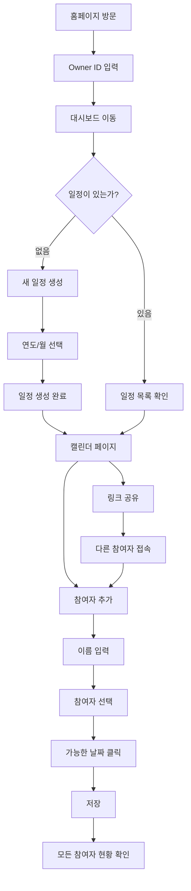
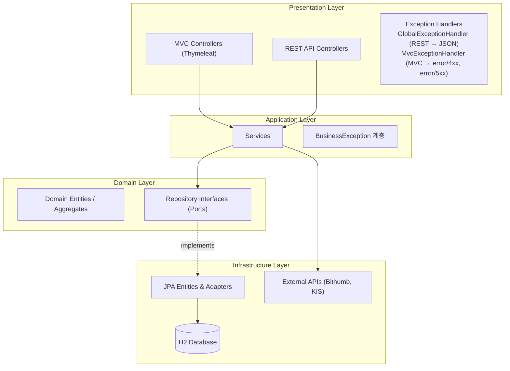
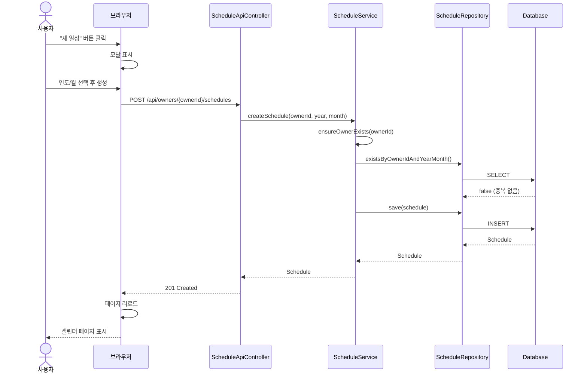
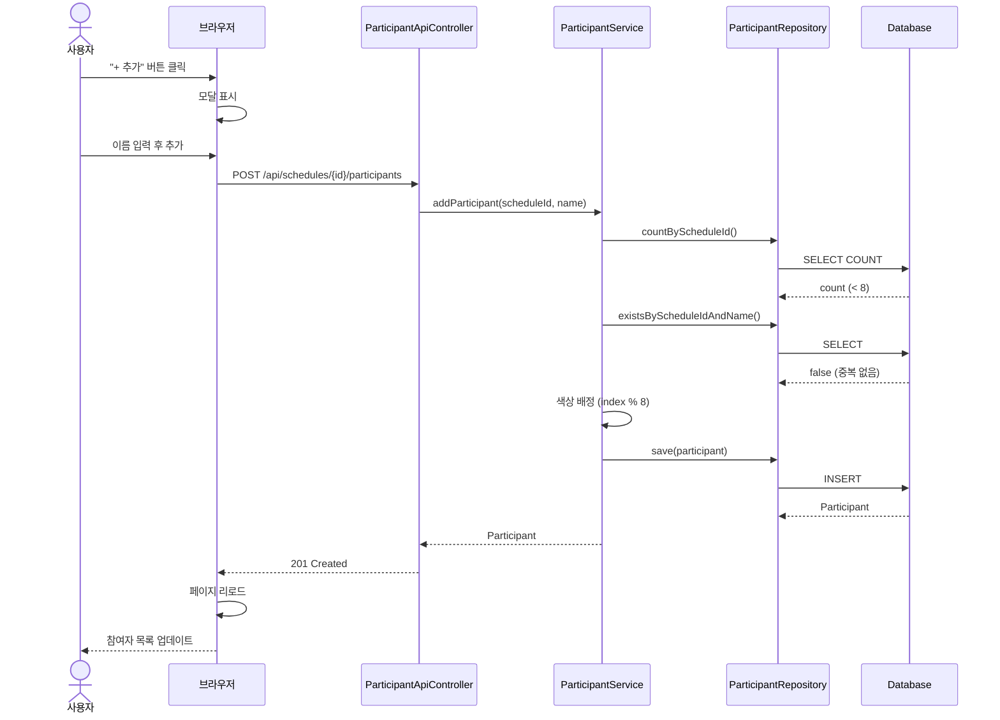
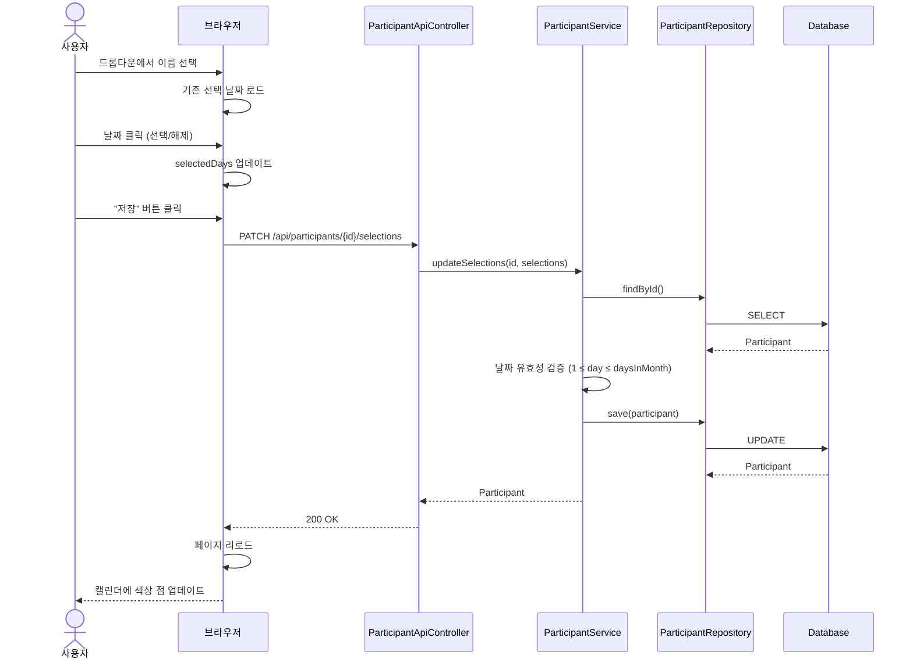

# Calendar — 멀티모듈 Spring Boot 웹 어플리케이션

Spring Boot 4.0.0 / Java 21 기반, 공통 인프라(`common`) 1개 + 도메인 4개로 구성된 웹 애플리케이션.

| 모듈 | 패키지 | 설명 |
|------|--------|------|
| **Common** | `common` | i18n / SEO / 보안 / 예외 처리 / sitemap — 도메인 무소속 공통 인프라 |
| **DateDate** | `datedate` | 그룹 일정 조율 - 여러 명이 가능한 날짜를 쉽게 찾아보는 서비스 |
| **Runner** | `runner` | 러닝 크루(97 Runners) 출석 관리, 순위 대시보드 |
| **Trading** | `trading` | Bithumb 암호화폐 자동매매 봇 (8지표 컨센서스 ±135점) |
| **Stock** | `stock` | 한국 주식 갭앤풀백 전략 봇 (한국투자증권 API) |

### 추가 문서

- [`docs/adr/`](docs/adr/) — 도메인별 / 관심사별 아키텍처 결정 기록 (36개 ADR)
- [`CLAUDE.md`](CLAUDE.md) — 코드 기반 사실 / 빌드·실행·테스트 명령어
- [`docs/architecture.md`](docs/architecture.md), [`docs/seo-evolution-playbook.md`](docs/seo-evolution-playbook.md), [`docs/stock-bot.md`](docs/stock-bot.md), [`docs/trading-bot.md`](docs/trading-bot.md) — 도메인 심화 자료

---

## 목차

1. [DateDate 서비스 소개](#datedate-서비스-소개)
2. [유저 플로우](#유저-플로우)
3. [시스템 아키텍처](#시스템-아키텍처)
4. [시퀀스 다이어그램](#시퀀스-다이어그램)
5. [Tech Stack](#tech-stack)
6. [실행방법](#실행방법)
7. [API Reference](#api-reference)
8. [프로젝트 구조](#프로젝트-구조)
9. [License](#license)

---

## DateDate 서비스 소개

### 해결하는 문제

그룹 모임이나 팀 미팅 일정을 잡을 때, 여러 사람의 가능한 날짜를 조율하는 것은 번거로운 일입니다.
카톡방에서 "언제 되세요?" 질문에 각자 다른 형식으로 답변하고, 그걸 취합하는 것도 일이죠.

**DateDate**는 이 문제를 해결합니다:
- 캘린더 형태로 각자 가능한 날짜를 클릭
- 모든 참여자의 선택이 한눈에 보임
- 링크 하나로 간편하게 공유

### 주요 기능

| 기능 | 설명 |
|------|------|
| 나만의 페이지 | 고유 ID로 개인 일정 관리 페이지 생성 (예: `datedate.site/my-team`) |
| 월별 일정 생성 | 원하는 연도/월의 일정 생성 및 관리 |
| 참여자 추가 | 일정당 최대 8명의 참여자 등록 |
| 날짜 선택 | 각 참여자가 가능한 날짜를 클릭하여 선택 |
| 시각적 확인 | 캘린더에서 모든 참여자의 가능 날짜를 색상 점으로 확인 |
| 링크 공유 | URL 복사 버튼으로 참여자 초대 |

### 대상 사용자

- 팀 미팅 일정을 조율해야 하는 팀 리더
- 모임 날짜를 정해야 하는 친구 그룹
- 회의 일정을 조율하는 직장인
- 스터디 그룹 일정을 정하는 학생

---

## 유저 플로우

### 전체 흐름 다이어그램


```mermaid
flowchart TD
    A[홈페이지 방문] --> B[Owner ID 입력]
    B --> C[대시보드 이동]
    C --> D{일정이 있는가?}
    D -->|없음| E[새 일정 생성]
    D -->|있음| F[일정 목록 확인]
    E --> G[연도/월 선택]
    G --> H[일정 생성 완료]
    H --> I[캘린더 페이지]
    F --> I

    I --> J[참여자 추가]
    J --> K[이름 입력]
    K --> L[참여자 선택]
    L --> M[가능한 날짜 클릭]
    M --> N[저장]
    N --> O[모든 참여자 현황 확인]

    I --> P[링크 공유]
    P --> Q[다른 참여자 접속]
    Q --> J
```

### Owner (일정 생성자) 여정

| 단계 | 화면 | 행동 | 결과 |
|------|------|------|------|
| 1 | 홈(`/`) | 고유 ID 입력 (예: `our-team`) | Owner 페이지 생성 |
| 2 | 대시보드(`/{ownerId}`) | "새 일정" 버튼 클릭 | 모달 열림 |
| 3 | 모달 | 연도/월 선택 후 생성 | 캘린더 페이지로 이동 |
| 4 | 캘린더 | "링크 복사" 버튼 클릭 | 클립보드에 URL 복사 |
| 5 | - | 참여자들에게 링크 공유 | 참여자 접근 가능 |

### Participant (참여자) 여정

| 단계 | 화면 | 행동 | 결과 |
|------|------|------|------|
| 1 | 캘린더 | 공유받은 링크로 접속 | 캘린더 페이지 표시 |
| 2 | 캘린더 | "+ 추가" 버튼 클릭 | 이름 입력 모달 열림 |
| 3 | 모달 | 이름 입력 후 추가 | 참여자 목록에 추가, 고유 색상 배정 |
| 4 | 캘린더 | 드롭다운에서 본인 이름 선택 | 선택 모드 활성화 |
| 5 | 캘린더 | 가능한 날짜 클릭 | 날짜 선택/해제 토글 |
| 6 | 캘린더 | "저장" 버튼 클릭 | 선택 완료, 캘린더에 색상 점 표시 |

### 결과 확인

모든 참여자의 선택이 캘린더에 **색상 점(dot)**으로 표시됩니다:
- 각 참여자는 고유한 색상 보유 (8가지 프리셋)
- 특정 날짜에 점이 많을수록 많은 사람이 가능한 날짜

---

## 시스템 아키텍처

### 헥사고날 아키텍처 (Ports & Adapters)

모든 모듈이 동일한 4계층 구조를 따릅니다:


```mermaid
graph TB
    subgraph Presentation["Presentation Layer"]
        MVC["MVC Controllers (Thymeleaf)"]
        API["REST API Controllers"]
        EH["Exception Handlers<br/>GlobalExceptionHandler (REST → JSON)<br/>MvcExceptionHandler (MVC → error/4xx, error/5xx)"]
    end

    subgraph Application["Application Layer"]
        Service["Services"]
        Exception["BusinessException 계층"]
    end

    subgraph Domain["Domain Layer"]
        Entities["Domain Entities / Aggregates"]
        Port["Repository Interfaces (Ports)"]
    end

    subgraph Infrastructure["Infrastructure Layer"]
        JPA["JPA Entities & Adapters"]
        External["External APIs (Bithumb, KIS)"]
        DB[(H2 Database)]
    end

    MVC --> Service
    API --> Service
    Service --> Port
    Port -.->|implements| JPA
    JPA --> DB
    Service --> External
```

### 계층별 역할

| 계층 | 패키지 | 역할 |
|------|--------|------|
| **Presentation** | `presentation/` | HTTP 요청/응답, 에러 핸들링 |
| **Application** | `application/` | 비즈니스 로직 조율, 서비스 |
| **Domain** | `domain/` | 핵심 비즈니스 규칙, 포트 인터페이스 |
| **Infrastructure** | `infrastructure/` | JPA 어댑터, 외부 API 클라이언트, 설정 |

### 에러 핸들링

- **`GlobalExceptionHandler`** — `@RestController` 전용, JSON `{ "code", "message" }` 반환
- **`MvcExceptionHandler`** — `@Controller` 전용, `error/4xx.html` 또는 `error/5xx.html` 렌더링

---

## 시퀀스 다이어그램

### 1. 일정 생성 (Create Schedule)


```mermaid
sequenceDiagram
    actor User as 사용자
    participant Browser as 브라우저
    participant API as ScheduleApiController
    participant Service as ScheduleService
    participant Repo as ScheduleRepository
    participant DB as Database

    User->>Browser: "새 일정" 버튼 클릭
    Browser->>Browser: 모달 표시
    User->>Browser: 연도/월 선택 후 생성
    Browser->>API: POST /api/owners/{ownerId}/schedules
    API->>Service: createSchedule(ownerId, year, month)
    Service->>Service: ensureOwnerExists(ownerId)
    Service->>Repo: existsByOwnerIdAndYearMonth()
    Repo->>DB: SELECT
    DB-->>Repo: false (중복 없음)
    Service->>Repo: save(schedule)
    Repo->>DB: INSERT
    DB-->>Repo: Schedule
    Repo-->>Service: Schedule
    Service-->>API: Schedule
    API-->>Browser: 201 Created
    Browser->>Browser: 페이지 리로드
    Browser-->>User: 캘린더 페이지 표시
```

### 2. 참여자 추가 (Add Participant)


```mermaid
sequenceDiagram
    actor User as 사용자
    participant Browser as 브라우저
    participant API as ParticipantApiController
    participant Service as ParticipantService
    participant Repo as ParticipantRepository
    participant DB as Database

    User->>Browser: "+ 추가" 버튼 클릭
    Browser->>Browser: 모달 표시
    User->>Browser: 이름 입력 후 추가
    Browser->>API: POST /api/schedules/{id}/participants
    API->>Service: addParticipant(scheduleId, name)
    Service->>Repo: countByScheduleId()
    Repo->>DB: SELECT COUNT
    DB-->>Repo: count (< 8)
    Service->>Repo: existsByScheduleIdAndName()
    Repo->>DB: SELECT
    DB-->>Repo: false (중복 없음)
    Service->>Service: 색상 배정 (index % 8)
    Service->>Repo: save(participant)
    Repo->>DB: INSERT
    DB-->>Repo: Participant
    Service-->>API: Participant
    API-->>Browser: 201 Created
    Browser->>Browser: 페이지 리로드
    Browser-->>User: 참여자 목록 업데이트
```

### 3. 날짜 선택 저장 (Update Selections)


```mermaid
sequenceDiagram
    actor User as 사용자
    participant Browser as 브라우저
    participant API as ParticipantApiController
    participant Service as ParticipantService
    participant Repo as ParticipantRepository
    participant DB as Database

    User->>Browser: 드롭다운에서 이름 선택
    Browser->>Browser: 기존 선택 날짜 로드
    User->>Browser: 날짜 클릭 (선택/해제)
    Browser->>Browser: selectedDays 업데이트
    User->>Browser: "저장" 버튼 클릭
    Browser->>API: PATCH /api/participants/{id}/selections
    API->>Service: updateSelections(id, selections)
    Service->>Repo: findById()
    Repo->>DB: SELECT
    DB-->>Repo: Participant
    Service->>Service: 날짜 유효성 검증 (1 ≤ day ≤ daysInMonth)
    Service->>Repo: save(participant)
    Repo->>DB: UPDATE
    DB-->>Repo: Participant
    Service-->>API: Participant
    API-->>Browser: 200 OK
    Browser->>Browser: 페이지 리로드
    Browser-->>User: 캘린더에 색상 점 업데이트
```

---

## Tech Stack

### Backend

| 분류 | 기술 | 버전 |
|------|------|------|
| Language | Java | 21 (LTS) |
| Framework | Spring Boot | 4.0.0 |
| ORM | Spring Data JPA / Hibernate | - |
| Security | Spring Security | - |
| Reactive | Spring WebFlux | Trading 모듈 (Bithumb API) |
| Validation | Jakarta Bean Validation | - |
| Template | Thymeleaf | - |
| Mail | Spring Mail (SMTP) | Stock 봇 알림 |
| Utility | Lombok | - |

### Database

| 분류 | 기술 | 비고 |
|------|------|------|
| RDBMS | H2 Database | MySQL 호환 모드 |
| Dev | File-based | `./data/scheduledb` |
| Test | In-memory | `create-drop` DDL |

### Frontend

| 분류 | 기술 | 비고 |
|------|------|------|
| Template Engine | Thymeleaf | Server-side rendering |
| JavaScript | Vanilla JS (ES6+) | 프레임워크 없음 |
| Styling | CSS3 | Custom properties, Flexbox, Grid |

### Build & Test

| 분류 | 기술 |
|------|------|
| Build Tool | Gradle |
| Testing | JUnit 5 + Mockito + AssertJ |

---

## 실행방법

### 사전 요구사항

- **Java 21** (LTS)
- **Gradle** (또는 프로젝트 내장 Gradle Wrapper 사용)

### 환경 설정

1. 프로젝트 클론
```bash
git clone https://github.com/your-repo/calendar.git
cd calendar
```

2. 환경 변수 설정 (`.env` 파일)
```bash
cp .env.example .env
# 필요시 .env 파일 편집 (DB_URL, BITHUMB_*, KIS_*, RUNNER_ADMIN_* 등)
```

### 빌드 및 실행

#### Linux / macOS

```bash
./gradlew build                        # 빌드 (테스트 포함)
./gradlew bootRun                      # 애플리케이션 실행
./gradlew test                         # 테스트 실행
./gradlew test --tests "*ServiceTest"  # 패턴 매칭 테스트
```

#### Jetson Nano / Linux (OpenClaw 컨테이너)

```bash
export JAVA_HOME=/usr/lib/jvm/jdk-21.0.5+11
export PATH=$JAVA_HOME/bin:$PATH

./gradlew bootRun --no-daemon --project-cache-dir /tmp/gradle-cache-calendar
```

#### WSL 환경 (Windows JDK 사용)

```bash
cmd.exe /c "set JAVA_HOME=C:\\jdk-21&& .\\gradlew.bat bootRun"
cmd.exe /c "taskkill /F /IM java.exe"   # H2 DB 잠금 해제 시
```

### 접속 정보

| 서비스 | URL | 비고 |
|--------|-----|------|
| 애플리케이션 | http://localhost:8081 | 메인 서비스 |
| H2 Console | http://localhost:8081/h2-console | user: `sa`, password: (없음) |
| Runner 관리자 | http://localhost:8081/runners/admin/login | `RUNNER_ADMIN_*` 환경변수 |

---

## API Reference

### Owner API

| Method | Endpoint | 설명 | Request Body | Response |
|--------|----------|------|--------------|----------|
| GET | `/api/owners/{ownerId}` | Owner 조회 | - | OwnerResponse |
| POST | `/api/owners` | Owner 생성 | `{ "ownerId": "string" }` | OwnerResponse |
| GET | `/api/owners/{ownerId}/schedules` | Owner의 일정 목록 | - | List |

### Schedule API

| Method | Endpoint | 설명 | Request Body | Response |
|--------|----------|------|--------------|----------|
| GET | `/api/owners/{ownerId}/schedules/{year}/{month}` | 일정 조회 | - | ScheduleDetailResponse |
| POST | `/api/owners/{ownerId}/schedules` | 일정 생성 | `{ "year": int, "month": int }` | ScheduleResponse |
| PATCH | `/api/owners/{ownerId}/schedules/{year}/{month}` | 일정 수정 | `{ "weeks": int }` | ScheduleResponse |
| DELETE | `/api/owners/{ownerId}/schedules/{year}/{month}` | 일정 삭제 | - | 204 No Content |

### Participant API

| Method | Endpoint | 설명 | Request Body | Response |
|--------|----------|------|--------------|----------|
| GET | `/api/schedules/{scheduleId}/participants` | 참여자 목록 | - | List |
| POST | `/api/schedules/{scheduleId}/participants` | 참여자 추가 | `{ "name": "string" }` | ParticipantResponse |
| DELETE | `/api/participants/{participantId}` | 참여자 삭제 | - | 204 No Content |
| PATCH | `/api/participants/{participantId}/selections` | 선택 날짜 수정 | `{ "selections": [int] }` | ParticipantResponse |

### Error Response

```json
{
  "code": "ERROR_CODE",
  "message": "오류 설명"
}
```

| Error Code | HTTP Status | 설명 |
|------------|-------------|------|
| OWNER_NOT_FOUND | 404 | Owner를 찾을 수 없음 |
| SCHEDULE_NOT_FOUND | 404 | Schedule을 찾을 수 없음 |
| PARTICIPANT_NOT_FOUND | 404 | Participant를 찾을 수 없음 |
| DUPLICATE_SCHEDULE | 409 | 해당 연/월에 이미 일정 존재 |
| DUPLICATE_PARTICIPANT | 409 | 동일 이름의 참여자 존재 |
| PARTICIPANT_LIMIT_EXCEEDED | 409 | 참여자 수 제한(8명) 초과 |
| INVALID_SELECTION | 400 | 유효하지 않은 날짜 선택 |
| INVALID_OWNER_ID | 400 | 유효하지 않은 Owner ID 형식 |

---

## 프로젝트 구조

```
calendar/
├── src/main/java/me/singingsandhill/calendar/
│   ├── CalendarApplication.java
│   ├── common/                          # 공통 인프라
│   │   ├── application/exception/       # BusinessException 기반 계층
│   │   ├── infrastructure/config/       # SecurityConfig, 기타 설정
│   │   └── presentation/
│   │       ├── api/GlobalExceptionHandler.java     # REST 에러 → JSON
│   │       └── controller/MvcExceptionHandler.java # MVC 에러 → 템플릿
│   │
│   ├── datedate/                        # 그룹 일정 조율 서비스
│   │   ├── domain/                      # Owner, Schedule, Participant
│   │   ├── application/                 # OwnerService, ScheduleService, ParticipantService 등
│   │   ├── infrastructure/              # JPA 어댑터
│   │   └── presentation/
│   │       ├── api/                     # REST Controllers
│   │       └── controller/              # MVC Controllers
│   │
│   ├── runner/                          # 러닝 크루 관리
│   │   ├── domain/                      # Run, Attendance
│   │   ├── application/                 # RunService, AttendanceService, RunnerAdminService
│   │   ├── infrastructure/
│   │   └── presentation/
│   │
│   ├── trading/                         # 암호화폐 자동매매 봇
│   │   ├── domain/                      # Trade, Position, Signal, Candle 등
│   │   ├── application/                 # SignalService, TradeService, RebalancingService 등
│   │   ├── infrastructure/              # Bithumb API 클라이언트, 스케줄러
│   │   └── presentation/
│   │
│   └── stock/                           # 한국 주식 갭앤풀백 봇
│       ├── domain/                      # StockCandidate, Position 등
│       ├── application/                 # ScreeningService, PullbackDetectionService 등
│       ├── infrastructure/              # KIS API 클라이언트, 스케줄러
│       └── presentation/
│
├── src/main/resources/
│   ├── application.yaml
│   ├── static/css/, static/js/
│   └── templates/
│       ├── fragments/                   # head, header, footer, scripts
│       ├── error/4xx.html, error/5xx.html
│       └── (모듈별 템플릿)
│
├── src/test/                            # JUnit 5 + Mockito + AssertJ
├── build.gradle
├── .env                                 # H2 DB, API 키 (gitignore)
├── CLAUDE.md
└── README.md
```

---

## License

[MIT License](LICENSE)
