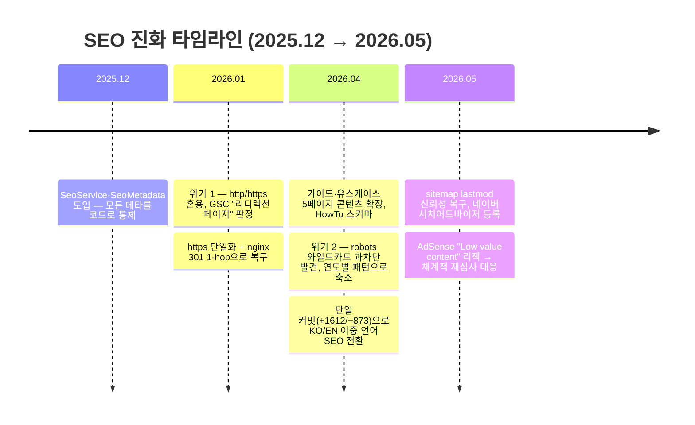
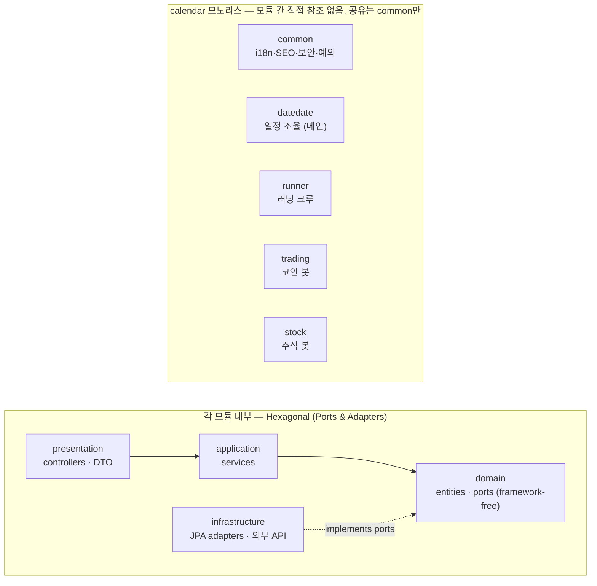

# datedate — 링크 하나로 끝내는 모임 날짜 조율

[](https://datedate.site/)


여러명이서 일정을 조율할 때 불편함을 느껴 해결해보고자 시작한 일정 조율 서비스입니다. 이 저장소(`calendar`)는
datedate와 함께, 같은 서버에서 돌아가는 암호화폐·주식 자동매매 봇을 담은
멀티 도메인 모노리스입니다.

> **English Summary** — datedate is a group-scheduling web service live at
> [datedate.site](https://datedate.site/): create a schedule, share one link, and everyone
> marks the days they can make it. It has hosted **874 schedules with 2,435 participants**,
> reaching **3.4k users in the first half of 2026** — mostly via organic search, driven by
> hand-built JSON-LD structured data, a bilingual hreflang/canonical strategy, and daily
> IndexNow submission. The repository is a multi-domain **Java 21 / Spring Boot 4** monolith
> (hexagonal architecture, server-side rendering + vanilla JS) self-hosted on a Jetson Nano.
> It also runs a crypto trading bot built to cover the server cost — safety-hardened after
> two self-conducted audits. Every significant decision is recorded in **59 ADRs**.

## 한눈에 보기

**874**개의 일정 · **2,435**명의 참여자 · **201**건의 장소/메뉴 투표
<sub>(2026-07-17, 서비스 홈 실시간 카운터 기준)</sub>

2026년 1월~7월 GA4 총 사용자 **3.4천 명**, 조회수 **1.8만**. 유입의 중심은 검색입니다 —
이 숫자를 어떻게 만들었는지가 아래 "성장 스토리"의 내용입니다.

## 왜 만들었나

그룹 모임이나 팀 미팅 일정을 잡을 때, 여러 사람의 가능한 날짜를 조율하는 것은 번거로운
일입니다. 카톡방에서 "언제 되세요?" 질문에 각자 다른 형식으로 답변하고, 그걸 취합하는
것도 일이죠.

datedate는 이 문제를 이렇게 풉니다.

- 캘린더에서 각자 가능한 날짜를 클릭
- 모든 참여자의 선택이 색상 점으로 한눈에
- 링크 하나로 공유 — 참여자는 로그인 없이 바로 시작

핵심 기능은 다섯 가지로 압축됩니다: 로그인 없는 시작(오너 ID만으로 나만의 페이지 생성),
일정당 최대 8명 참여, 장소·메뉴 투표, 인기 장소/메뉴 통계(`/insights/trends`),
그리고 선택적 카카오 로그인 — 로그인하면 한 해의 모임 기록을 모아 보여주는
연간 리캡(`/recap/{year}`)과 카카오톡 공유용 리캡 페이지가 열립니다.

## 성장 스토리 — 검색 유입 0에서 3개월 752 클릭까지

기능을 만드는 것과 사용자가 찾아오게 만드는 것은 완전히 다른 문제였습니다.
datedate에서 가장 오래, 가장 깊게 판 영역이 SEO와 측정입니다.

### SEO를 코드로 풀다

검색엔진에 *보여줄 것*과 *숨길 것*을 전부 코드로 통제합니다.

- **JSON-LD 구조화 데이터를 직접 조립** — `SeoService`가 페이지별로 WebApplication,
  WebSite, Organization, BreadcrumbList, FAQPage, HowTo 스키마 그래프를 생성합니다.
  FAQ 스키마는 해당 언어에 콘텐츠가 실재할 때만 출력됩니다(빈 Q&A로 인한 리치 결과
  페널티 방지).
- **이중 언어 SEO** — 한국어 canonical + 영어 `?lang=en` canonical + hreflang
  `ko`/`en`/`x-default`. 언어별 중복 색인을 막으면서 두 언어 모두 색인됩니다.
- **UGC는 전면 noindex** — 사용자가 만든 일정·대시보드 페이지는 검색에 노출하지
  않습니다. 통계 페이지(`/insights/trends`)는 데이터가 얇으면 **스스로 noindex로
  강등**됩니다(thin-content 신호 차단).
- **신뢰할 수 있는 sitemap** — 이중 언어 alternate 링크 포함 동적 생성,
  `lastmod`는 빌드 시각과 최신 사용자 활동 기준(매번 오늘 날짜를 찍는 안티패턴 제거).
- **IndexNow 자동 제출** — 매일 03:30 KST에 전체 sitemap URL을 Bing/Naver 계열에
  제출하는 fail-soft 스케줄러(실패해도 서비스에 영향 없음).


```mermaid
timeline
    title SEO 진화 타임라인 (2025.12 → 2026.05)
    2025.12 : SeoService·SeoMetadata 도입 — 모든 메타를 코드로 통제
    2026.01 : 위기 1 — http/https 혼용, GSC "리디렉션 페이지" 판정 : https 단일화 + nginx 301 1-hop으로 복구
    2026.04 : 가이드·유스케이스 5페이지 콘텐츠 확장, HowTo 스키마 : 위기 2 — robots 와일드카드 과차단 발견, 연도별 패턴으로 축소 : 단일 커밋(+1612/−873)으로 KO/EN 이중 언어 SEO 전환
    2026.05 : sitemap lastmod 신뢰성 복구, 네이버 서치어드바이저 등록 : AdSense "Low value content" 리젝 → 체계적 재심사 대응
```

전체 과정은 [`docs/seo/evolution-playbook.md`](docs/seo/evolution-playbook.md)에
sitemap 성숙도 모델(L0~L5), 트러블슈팅 8건, 안티패턴 10개로 정리해 두었습니다.

### 두 번의 위기와 AdSense 리젝

성장 곡선은 직선이 아니었습니다. 실수는 감추는 대신 감지→복구→재발 방지의 소재로
썼습니다.

- **위기 1: 리다이렉트 체인.** http/https 혼용으로 GSC가 주요 페이지를 "리디렉션
  페이지"로 판정. 4곳에 흩어진 프로토콜 설정을 https로 단일화하고 nginx 301을
  1-hop으로 정리했습니다.
- **위기 2: robots 과차단.** 제가 넣은 `Disallow: /*/*` 와일드카드가 정상 페이지의
  색인까지 막고 있었습니다. 연도별 패턴(`/*/2024/`…)으로 좁혀 복구 — 원인이 내 결정일
  때 그걸 문서에 남기는 것까지가 수습이라고 생각합니다.
- **AdSense "Low value content" 리젝 (2026-05).** 리젝 사유를 정책 문서 4건과 1:1로
  매핑해 페이지별 위험도를 등급화하고, 구조적 원인을 고쳤습니다: 임의 URL 접속만으로
  오너가 자동 생성되던 것을 제거해 soft-404를 진짜 404로(봇이 만든 DB 오염도 함께
  해결), 인기 통계에 0표 항목·비속어가 노출되지 않도록 노출 기준(최소 2표 +
  블록리스트)을 [ADR](docs/adr/datedate/domain/0006-popularity-exposure-criteria.md)로
  결정, 회귀 테스트 6종을 추가했습니다. 현재 재심사 대응 진행 중입니다 —
  대응 과정 전체는 [`docs/seo/adsense-low-value-content-remediation.md`](docs/seo/adsense-low-value-content-remediation.md)에
  있습니다.

### 결과

| 지표 | 값 | 출처 · 기간 |
|---|---|---|
| 검색 클릭 | 752 | Google Search Console · 최근 3개월 |
| 검색 노출 | 8,320 | 〃 |
| 평균 CTR | **9%** | 〃 |
| 평균 게재순위 | **6.2** | 〃 |
| 총 사용자 | 3.4천 | GA4 · 2026.01~07 |
| 조회수 | 1.8만 | 〃 |
| 이벤트 수 | 6.4만 | 〃 |

<sub>2026-07-17 기준. GA4 전년 동기 대비 성장률은 +3,842%로 표시되지만, 비교 분모가
서비스 초기의 작은 값이라 참고 지표로만 봅니다.</sub>

평균 CTR 9%와 게재순위 6.2는 "노출만 되는" 단계를 지나 검색 의도에 맞는 페이지가
상위에 잡히고 있다는 신호로 읽고 있습니다.

## 데이터로 운영하기

기능이 있다는 것과 사용자가 그 기능을 이해하고 전환한다는 것은 다르므로, 측정
인프라를 함께 설계했습니다.

- **스택**: GA4 + GTM + BigQuery export + Looker Studio, Search Console 연동.
- **퍼널 이벤트 ~11종**을 코드에서 직접 push합니다:
  `schedule_created` → `schedule_viewed` → `participant_added` → `selections_saved` →
  `location_added`/`menu_added` → `vote_cast` → `link_shared` — 어느 단계에서
  이탈하는지 추적하기 위한 설계입니다.
- **PII 원칙**: 참여자 이름은 dataLayer에 절대 넣지 않습니다. 식별이 필요한 값은
  SHA-256 해시 헬퍼를 거치고, 트레이딩·주식 봇 페이지는 추적과 광고에서 의도적으로
  제외했습니다(비공개 운영 페이지).

GTM 트리거 세부 매핑과 DB→BigQuery 미러링은 백로그에 있는 다음 단계입니다.

## 만들며 풀었던 문제들

문제 → 원인 → 해결 → 남긴 테스트 순서로, 기억에 남는 것들만.

- **첫 화면이 3MB.** Lighthouse 감사에서 Pretendard 폰트 하나가 2MB를 차지하는 것을
  발견, dynamic-subset으로 교체해 약 1.6MB를 덜어냈습니다. 결과: FCP 1.0s,
  LCP 1.2s, CLS 0.001.
- **"2,026년 1월 일정"** — MessageFormat이 연도에 천단위 콤마를 찍는 버그.
  `{n,number,#}` 패턴으로 차단하고 `SeoServiceI18nTest`에 회귀 가드를 남겼습니다.
  언어 전환이 두 번째 새로고침에야 반영되던 버그는 로케일을 요청 속성에 캐시해
  해결했고, KO/EN 메시지 카탈로그는 `MessageCatalogParityTest`가 키 동등성을
  강제합니다.
- **`/{ownerId}` 와일드카드의 함정.** 오너 페이지가 루트 경로를 쓰기 때문에
  `/login`, `/recap` 같은 라우트가 오너 ID로 선점될 수 있습니다. 예약어
  ~40토큰을 도메인 상수로 관리하고 기존 데이터 마이그레이션 체크까지 걸었습니다.
- **분석이 핵심 흐름을 깨면 안 된다.** 카카오 로그인 사용자의 활동 기록
  (`UserActivity`)은 `REQUIRES_NEW` 트랜잭션에서 예외를 삼키며 기록됩니다 —
  이벤트 적재가 실패해도 일정 생성·투표는 절대 실패하지 않습니다. 오너 연결은
  first-claim 정책(먼저 로그인해 연결한 사람이 소유, 재연결 시도는 예외)으로
  단순하게 풀었습니다.
- **연간 리캡 공유.** `/recap/{year}`는 스냅샷 없이 실시간 집계하고, 공유는
  `(userId, year)`별 멱등 토큰 페이지로 — 로그인 없이 열리지만 noindex,
  카카오톡 미리보기용 OG 메타만 노출합니다.

## Trading Bot — 서버비는 봇이 벌게 하자

자가 호스팅이라도 전기세와 도메인비는 나갑니다. 그 비용을 충당해 보려고 만든
Bithumb 자동매매 봇이고, 그래서 이 모듈의 이야기는 수익 자랑이 아니라
**"돈이 걸린 코드를 어떻게 안전하게 굴리는가"**입니다.

### 8지표 합의 시그널 엔진

1분봉 기준, 매분 :05초(캔들 마감 직후)에 트레이딩 루프가 돕니다. 단일 지표는
거짓말을 하므로 8개 지표(MA 크로스/상태/추세, RSI 다이버전스/레벨/추세,
스토캐스틱 다이버전스/레벨, 거래량 다이버전스)의 가중 점수를 합산합니다 —
설계 당시 ±135점, 모멘텀 과대 가중을 튜닝한 현재 ±128점.

진입은 3중 게이트를 모두 통과해야 합니다: |점수| ≥ 40, **8개 중 3개 이상 지표가
같은 방향으로 동의**, RSI/스토캐스틱 과열 가드 통과. 여기에 MA5·MA20이 0.2% 이내로
붙은 횡보장에서는 크로스 신호 자체를 무시합니다(휩쏘 노이즈 필터).

### 내 봇의 결함을 내가 찾다

이 봇의 가장 큰 성과는 수익이 아니라, 구조적으로 손해 보는 설계였다는 걸 스스로
진단하고 고친 과정입니다.

- **[수익성 감사 (2026-05-30)](docs/audit/coin-trading-profit-audit-2026-05-30.md)** —
  6개 차원에서 봇을 해부한 결론은 "구조적으로 기대값 음수": 익절은 +0.6%에서 잘리고
  손절은 −3%까지 열려 있어 승률 83%가 필요한 역전된 손익비, 사실상 도달 불가능한
  +15% TP, 리밸런싱이 만든 포지션이 손절 추적 밖에 있는 문제. 이 발견들이 P0/P1/P2
  개선 시리즈와 ADR들로 이어졌습니다.
- **[운영·보안 리뷰 (2026-07-06)](docs/audit/coin-trading-operational-review-2026-07-06.md)** —
  8개 관점에서 73건의 발견 사항을 적대적으로 검증했고, 그 과정에서 **실주문 API가
  인증 없이 열려 있는 것을 발견**했습니다. 사고가 나기 전에 `ROLE_ADMIN` 잠금과
  무인증/비관리자 차단 회귀 테스트로 봉쇄했습니다.

### 안전장치

- **LIVE / PAPER / BACKTEST 모드 게이트** — 기본값은 PAPER. 모든 주문 경로 진입부에
  모드 가드가 있고, 비-LIVE 모드는 인메모리 체결 시뮬레이션으로 대체됩니다.
  실거래는 명시적으로 켜야만 가능합니다.
- **주문 멱등성** — 주문 전에 client-order-id와 함께 SUBMITTED 상태를 먼저 저장하고,
  응답 유실 시 **재전송이 아니라 재조회**로 복구합니다(이중 체결 방지). 매 루프마다
  미결 주문 정리 스윕이 돕니다.
- **서킷 브레이커** — 3연속 손실 또는 일일 −5% 도달 시 신규 진입 차단. 손절 등
  리스크 청산은 계속 허용됩니다.

<details>
<summary>나머지 안전장치 보기</summary>

- **수수료 반영 순손익 모델** — 모든 손익 판단은 왕복 수수료·슬리피지를 뺀 순수익
  기준. "수수료 때문에 이기고도 지는" 거래를 구조적으로 차단.
- **트랜잭션 경계** — 거래소 HTTP 호출과 대기(sleep)를 DB 트랜잭션 밖으로 분리
  (`TransactionTemplate`), 커넥션 점유·롤백 꼬임 방지.
- **ATR 기반 동적 포지션 사이징** — 변동성이 클수록 작게(15%), 작을수록 크게(35%)
  진입해 실질 리스크를 일정하게 유지.
- **본전 바닥 트레일링 스톱** — 트레일링이 진입가 아래로 내려가 손실로 전환되는 것을
  차단.
- **쿨다운 + 최소 보유 시간** — 신호 핑퐁으로 인한 잦은 매매 방지.
- **Bithumb v2 주문 API 어댑터** — v2 응답을 v1 형태로 정규화해 애플리케이션 계층을
  버전 무관하게 유지. MockWebServer 기반 TDD로 마이그레이션 진행.

</details>

### Stock Bot — 같은 근육, 다른 시장

한국투자증권 API로 국내 주식 갭앤풀백 데이트레이딩(09:20~11:20 KST, 이후 전량 청산)을
돌리는 두 번째 봇입니다. 트레이딩 봇에서 배운 것을 다른 시장에 적용하며 다듬었습니다.

- WATCHING → HIGH_FORMED → PULLBACK → ENTRY_READY → ENTERED 상태머신 + 5-팩터
  스크리닝 스코어, 비순차 3단계 익절(TP1/TP2/TP3)
- 동시성 3-레이어: KIS API `Semaphore(8)` 호출 제한, 종목별 `ReentrantLock`,
  스케줄러 풀 분리
- `event=NAME key=value` 구조화 이벤트 로깅과 BotStatus 메트릭 — "봇이 죽었나,
  후보가 없나"를 로그 한 줄로 구분
- `Clock` 빈 주입으로 시간 의존 로직 전부 결정론적 테스트 가능

이 밖에 러닝 크루(97 Runners) 출석·랭킹 관리 모듈(`runner`)을 지인들과 소규모로
운영하고 있습니다.

## 기록하며 개발하기

혼자 개발할수록 문서가 필요합니다 — 미래의 나는 남이니까요. 이 저장소는 세 층으로
기록합니다.

- **결정은 ADR로** — [59개](docs/adr/), 도메인×관심사 매트릭스로 색인. 모든 ADR은
  "외부 트리거 → 결정 → 대안 비교 → 영향" 순서로, 트레이딩·주식 봇 ADR 대부분은
  감사 발견 사항 번호까지 역추적됩니다.
- **사건은 감사 문서로** — 수익성 감사, 운영 리뷰, AdSense 정책 매핑 등. 사건이
  끝나면 회귀 테스트로 봉인합니다(`SeoServiceI18nTest`, `MessageCatalogParityTest`,
  `TradingApiSecurityTest` 등 — 테스트 파일 69개, 413개 통과).
- **반복 가능한 지식은 플레이북으로** — SEO 진화 플레이북, 트러블슈팅 모음.

## 아키텍처 & 기술 스택


```mermaid
graph TB
    subgraph Mono["calendar 모노리스 — 모듈 간 직접 참조 없음, 공유는 common만"]
        direction LR
        common["common<br/>i18n·SEO·보안·예외"]
        datedate["datedate<br/>일정 조율 (메인)"]
        runner["runner<br/>러닝 크루"]
        trading["trading<br/>코인 봇"]
        stock["stock<br/>주식 봇"]
    end
    subgraph Hex["각 모듈 내부 — Hexagonal (Ports & Adapters)"]
        P["presentation<br/>controllers · DTO"] --> A2["application<br/>services"]
        A2 --> D["domain<br/>entities · ports (framework-free)"]
        I["infrastructure<br/>JPA adapters · 외부 API"] -.->|implements ports| D
    end
    Mono ~~~ Hex
```

| 모듈 | 설명 |
|------|------|
| `common` | i18n / SEO / 보안 / 예외 처리 / sitemap — 도메인 무소속 공통 인프라 |
| `datedate` | 그룹 일정 조율 — 이 README의 주인공 |
| `runner` | 러닝 크루 출석·랭킹 관리 |
| `trading` | Bithumb 암호화폐 자동매매 봇 (8지표 합의, 설계 ±135 → 현재 ±128) |
| `stock` | 한국 주식 갭앤풀백 봇 (한국투자증권 API) |

Java 21 · Spring Boot 4.0.0 · Spring Data JPA/H2(MySQL 호환 모드) · Spring Security ·
WebFlux(거래소 API) · Thymeleaf SSR + vanilla JS ES modules(프론트 프레임워크 없음) ·
Tailwind(봇 대시보드) · Gradle · JUnit 5/Mockito/AssertJ.

배포는 nginx 뒤의 **Jetson Nano 홈서버**입니다. 제약이 많은 환경이 오히려 폰트 서브셋,
ETag/Cache-Control 전략 같은 성능 튜닝의 동기가 됐습니다.

<details>
<summary><b>직접 실행해 보기</b></summary>

```bash
# Java 21 필요
cp .env.example .env      # 필요시 API 키 등 편집 (봇 미사용 시 그대로 두면 됨)
./gradlew bootRun         # http://localhost:8081
./gradlew test
```

WSL·Jetson 등 환경별 명령은 [`CLAUDE.md`](CLAUDE.md) 참고.

</details>

## 더 읽을거리

이 README는 요약이고, 깊이는 아래에 있습니다.

- [`docs/adr/`](docs/adr/) — 아키텍처 결정 기록 55건 (도메인×관심사 매트릭스)
- [`docs/seo/evolution-playbook.md`](docs/seo/evolution-playbook.md) — SEO 0→1 과정을 재사용 가능한 플레이북으로
- [`docs/seo/adsense-low-value-content-remediation.md`](docs/seo/adsense-low-value-content-remediation.md) — AdSense 리젝 대응 전 과정
- [`docs/audit/coin-trading-profit-audit-2026-05-30.md`](docs/audit/coin-trading-profit-audit-2026-05-30.md) — 내 봇의 기대값이 음수였던 이유
- [`docs/audit/coin-trading-operational-review-2026-07-06.md`](docs/audit/coin-trading-operational-review-2026-07-06.md) — 73건 발견 사항 운영·보안 리뷰
- [`docs/trading/bot.md`](docs/trading/bot.md) / [`docs/stock/bot.md`](docs/stock/bot.md) — 두 봇의 전략·리스크 관리 상세
- [`docs/architecture.md`](docs/architecture.md) — 헥사고날 구조와 모듈 규약

## License

[MIT License](LICENSE)
